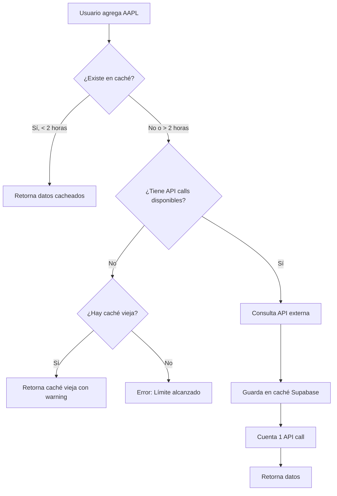
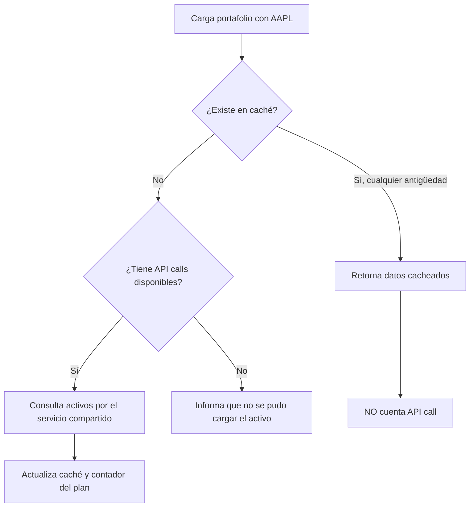

# Optimización de Caché y API Calls

## 📋 Resumen

Este documento explica cómo funciona el sistema de caché optimizado para minimizar el uso de API calls y mejorar la experiencia del usuario.

## 🎯 Problemas Resueltos

### 1. **Llamadas por activo y por plan**

- `fetchTickerData` consulta primero la caché de Supabase; los datos de hasta 2 horas se reutilizan sin consumir el límite diario.
- Al vencer la caché, se verifica `plans.roleLimits` antes de consultar FMP o Yahoo. El fallback de Yahoo se ejecuta bajo la misma verificación y cuenta como parte de la consulta del activo, no como una llamada adicional.
- Si la consulta de FMP falla pero Yahoo devuelve datos utilizables, esa consulta exitosa también actualiza el contador diario.
- El proveedor del portafolio usa el mismo servicio: reutiliza la caché aunque esté vencida y solo consulta APIs para símbolos sin datos guardados. Esas consultas faltantes se verifican y cuentan según el plan del usuario.
- Los gráficos de composición e historia del portafolio reutilizan el `AssetData` ya cargado por el proveedor en vez de iniciar consultas paralelas por cada posición.
- El comparador SPY/QQQ consulta Yahoo solo al seleccionarse, agrupa ambos símbolos en una operación y cuenta esa operación contra el límite del usuario. La respuesta se conserva en caché de React Query durante una hora.
- DATA912 entrega cotizaciones públicas y no consume el contador de consultas de activos; sus fallas se reportan por mercado para no ocultar el mercado que sí respondió.

### 2. **Tiempos de Caché Optimizados**

**Antes:**

| Tipo de Caché | Duración Anterior |
|---------------|-------------------|
| Supabase DB | 1 hora |
| React Query staleTime | 5 minutos |
| React Query gcTime | 15 minutos |

**Ahora:**

| Tipo de Caché | Duración Nueva | Razón |
|---------------|----------------|-------|
| Supabase DB | **2 horas** | Los datos financieros no cambian tan rápido |
| React Query staleTime | **10 minutos** | Reduce refetches innecesarios |
| React Query gcTime | **30 minutos** | Mantiene datos en memoria más tiempo |

**Impacto:**
- ✅ Menos API calls
- ✅ Respuestas más rápidas (datos en caché)
- ✅ Mejor experiencia de usuario
- ✅ Permite trabajar con límite de API más bajo

## 🔄 Flujo de Datos

### Caso 1: Usuario Agrega Ticker Manualmente (Input)



### Caso 2: Usuario Entra con Portafolio (Automático)



## 📊 Ejemplo Práctico

### Escenario: Usuario Plan Básico (5 llamadas diarias)

**Antes de la optimización:**
```
8:00 AM - Usuario entra al dashboard con 3 activos en portafolio
          → Consume 3 API calls (2 restantes)

10:00 AM - Agrega MSFT manualmente
           → Consume 1 API call (1 restante)

11:00 AM - Agrega GOOGL manualmente  
           → Consume 1 API call (0 restantes)

12:00 PM - Intenta agregar TSLA
           → ❌ ERROR: Límite alcanzado
```

**Después de la optimización:**
```
8:00 AM - Usuario entra al dashboard con 3 activos en portafolio
          → Consume 0 API calls (5 restantes) ✅

10:00 AM - Agrega MSFT manualmente
           → Consume 1 API call (4 restantes)

11:00 AM - Agrega GOOGL manualmente  
           → Consume 1 API call (3 restantes)

12:00 PM - Agrega TSLA manualmente
           → Consume 1 API call (2 restantes) ✅

2:00 PM - Agrega NVDA manualmente
          → Consume 1 API call (1 restante)

4:00 PM - Agrega AMD manualmente
          → Consume 1 API call (0 restantes)
```

## ⚙️ Configuración

### Servicio: `asset-api.ts`

```typescript
// Consultas de activos: caché de Supabase antes de verificar el cupo.
const twoHoursAgo = new Date(Date.now() - 2 * 60 * 60 * 1000);
if (!forceRefresh && cached && new Date(cached.last_updated_at) > twoHoursAgo) {
    return cached.data as AssetData;
}
```

El contador por rol está en `public/config.json` (`basico: 5`, `plus: 25`,
`premium: 50`, `administrador: 100000`). Los gráficos de análisis e historia
del portafolio reutilizan los datos ya cargados; no inician una segunda
consulta por cada posición. Yahoo fallback/suplemento forma parte de la misma
consulta del activo. La comparación SPY/QQQ sí consume una llamada cuando se
selecciona por primera vez y se guarda en caché durante una hora. DATA912 es
un feed público y queda fuera de ese contador.

### Caché de React Query

```typescript
staleTime: 1000 * 60 * 10, // 10 minutos
gcTime: 1000 * 60 * 30,    // 30 minutos
```

## 🎯 Beneficios

### Para Usuarios Plan Básico (5 calls/día)
- ✅ Pueden tener 3 activos en portafolio + agregar 5 más manualmente
- ✅ Total: 8 activos analizables vs 5 antes

### Para Usuarios Plan Plus (25 llamadas/día)
- ✅ Pueden tener 5 activos en portafolio + agregar 25 más
- ✅ Total: 30 activos analizables en el dashboard

### Para Usuarios Plan Premium (50 calls/día)
- ✅ Pueden tener 10 activos en portafolio + agregar 50 más
- ✅ Total: 60 activos analizables vs 50 antes

## 📝 Notas Importantes

1. **La caché se comparte entre dashboard y otras vistas**
   - Si consultas AAPL en el dashboard, la caché se usa en el portafolio también

2. **Los datos se actualizan cada 2 horas máximo**
   - Para datos más frescos, el usuario puede remover y volver a agregar el ticker

3. **El reseteo diario de contadores es independiente**
   - A medianoche UTC todos los contadores vuelven a 0
   - La caché de Supabase NO se borra (sigue válida por 2 horas desde su creación)

4. **Avisos del portafolio**
   - Los datos guardados se reutilizan sin consumir consultas del plan
   - Si faltan datos guardados y el usuario no tiene consultas disponibles, se informa qué activos no pudieron cargarse

## 🔮 Mejoras Futuras

- [ ] Botón para "Actualizar datos" manualmente (consume 1 API call)
- [ ] Mostrar en UI cuándo fue la última actualización de cada activo
- [ ] Permitir configurar el tiempo de caché por usuario (premium)
- [ ] Sistema de cola para actualizar activos de mayor a menor prioridad
